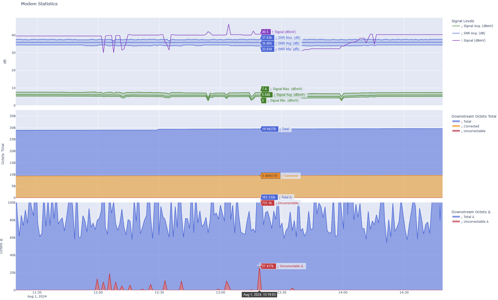

# modem-info
[](https://pypi.python.org/pypi/modem-info)
[](https://pypi.python.org/pypi/modem-info)
[](https://pypi.python.org/pypi/modem-info)
[](https://github.com/ReK42/modem-info/blob/main/LICENSE)
[](https://github.com/ReK42/modem-info/commits/main)
[](https://github.com/ReK42/modem-info/actions)

Collect and plot detailed information and statistics from your modem.



## Installation
Install [Python](https://www.python.org/downloads/), then install [pipx](https://github.com/pypa/pipx) and use it to install `modem-info`:
```sh
pipx install modem-info
```

## Usage
**Note:** Ensure the `--path` (default: `./data`) exists and is writable.

To collect statistics from a supported modem, use the `get` command with at least one of `--csv` or `--json`:
```sh
modem-info get [--csv] [--json] <ADDRESS>
```

To plot statistics that were saved in CSV format, use the `plot` command:
```sh
modem-info plot <FILE>
```

For all options, run:
```sh
modem-info <COMMAND> --help
```

## Supported Modems
| Vendor | Model   | Driver Package                     |
| ------ | ------- | ---------------------------------- |
| Hitron | CODA-45 | `modem_info.drivers.hitron.coda45` |

## Development Environment
### Installation
```sh
git clone https://github.com/ReK42/modem-info.git
cd modem-info
python -m venv .env
source .env/bin/activate
python -m pip install --upgrade pip pre-commit
pre-commit install
pip install -e .[test]
```

### Manual Testing
```sh
mypy src
ruff check src
ruff format --diff src
```

### Manual Building
```sh
pip install -e .[build]
python -m build
```
